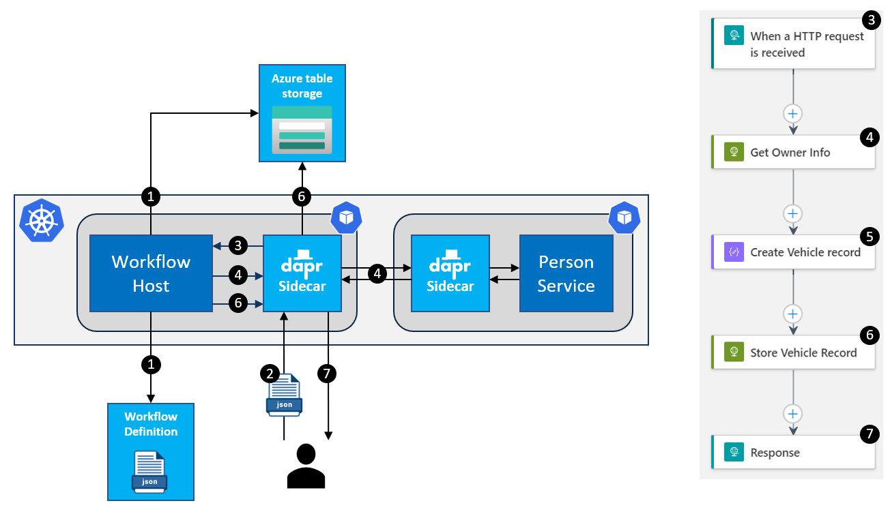

# Logic Apps with Dapr sample application

This is a sample app that uses Logic Apps with Dapr. The functionality is very simple. It's a simplified vehicle registration flow. You send a registration request to the application. It will call a service to get some information of the owner of the vehicle by his/her id that is part of the registration request. It then creates a registration record and stores is in a data store. Here's an overview of this flow:


**Figure 1**: Data flow overview

The application runs in Kubernetes. There is a dedicated container image (maintained by Microsoft) that contains a workflow host that can execute Logic Apps definitions. Dapr is enabled for the host, so a Dapr sidecar is added to its pod. The Dapr sidecar handles all the communication between the application and external resources. From the workflow it is very easy to call the Dapr APIs offered by the sidecar, because they can be called using simple HTTP requests. This is an description of how the application works technically:


**Figure 2**: Technical architecture diagram

1. When the application is started, the workflow host container will read the workflow definition and start a listener for it. It also registers the workflow in the workflow state-store. At this moment, it can only use an Azure Storage account. More options will become available in the future.

1. A user sends an HTTP request to the Dapr sidecar of the workflow host. The payload is a vehicle registration request (see Figure 1 for the message schema).

1. The sidecar forwards the request to the workflow host. The host starts an instance of the workflow and executes the HTTP trigger in the workflow.

1. The next activity in the workflow calls a service using the Dapr service invocation building block. It calls the `invoke` API on the Dapr sidecar. The sidecar forwards the request to the PersonService's sidecar and returns the response to the workflow (see Figure 1 for the message schema).

1. The next activity in the workflow creates a vehicle record by combining data from the initial vehicle registration request and the response from the PersonService (see Figure 1 for the message schema).

1. The next activity in the workflow stores the vehicle record using the Dapr state management building block. It calls the `state` API on the Dapr sidecar. The state management building block is configured to use the same Azure Storage account as used for storing the workflow state.

1. Once the record is stored, the last activity in the workflow return a `200 OK` response.

## Starting the application

To start the application, make sure the following prerequisites are met:

- You are working in VS Code.
- You have Docker Desktop installed with Kubernetes enabled.
- You have basic knowledge of working with Docker containers and Kubernetes.
- You have access to an Azure Storage account.

These are the steps to take in order to start and test the application:

1. Start Docker for Desktop with Kubernetes.

1. Go to the `/src/PersonService` folder.

1. Build the **PersonService** docker image by executing the `build-docker-images.ps1` script.

1. Create an (or reuse an existing) Azure Storage account. Retrieve the account name and access key.

1. Make 2 environment variables that hold the account-name and key:

   ```powershell
   $env:DAPR_STORAGE_ACCOUNT_NAME = <account name>
   $env:DAPR_STORAGE_ACCOUNT_KEY = <account key>
   ```

1. Go to the `/src/deploy` folder.

1. Run the application by executing the `start.ps1` script.

1. Wait some time for the containers to come up. Use the command `kubectl get deployment -n vehicle-registration` to check this:

   
   **Figure 3**: Check for running deployments

1. Setup port forwarding by executing the `setup-port-forwarding.ps1` script.

1. Install the [`REST Client` extension for VS Code](https://marketplace.visualstudio.com/items?itemName=humao.rest-client).

1. Open the file `/src/requests/register-vehicle.http`.

1. Execute the request. You should receive a HTTP status-code `200 OK`.

If you don't receive a response with HTTP status-code `200 OK` and the body of the vehicle record, check the logging from the containers to see where the error occurred. You can also query the workflow state tables created in the Azure Storage account. You can find the result status for every individual activity in the workflow (in the table named `flow<flow-identifier>actions`).
